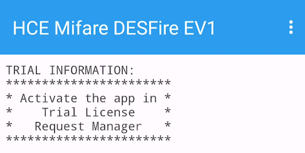
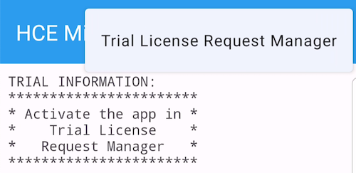
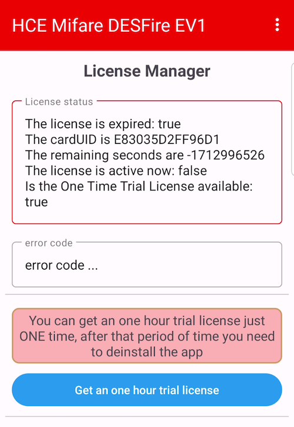
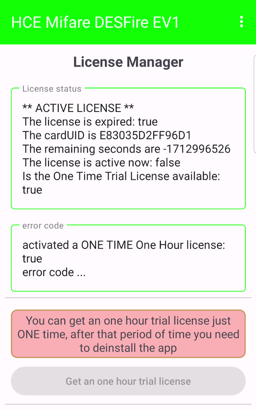
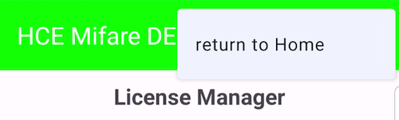

# NFC HCE DESFire tag

is a project to provide a virtual, emulated Mifare DESFire EV1 tag on base of **Host Card Emulation** (HCE).

*Mifare DESFire is a trademark of NXP Semiconductors N.V., Netherlands.*

The base of this project was given by the GitHub user "piotrekwitkowski", who provided a lot of valuable code here: 
https://github.com/piotrekwitkowski/LibraryNFC. As there is no license given I assume that the original code is **Free Domain**.

## Notes by AndroidCrypto
The app is developed using Grade 8.2 and Java 17 and the app is running on real Android devices (Samsung A5 [Android 8] and 
Samsung Galaxy S8 [Android 9], additionally tested on a Samsung A51 [Android 13]).

Due to Android's NFC system you need to run the "Select Application by Application DF Name" as the initial command, all other commands are 
running like using a real DESFire tag.

Please use this **DF Application name: D2760000850100** for selection.

## Purpose of this app

This app is an accompanying app for the project **Building an Access Control System based on Mifare DESFire**, published here: 
https://medium.com/@androidcrypto/design-an-access-control-system-based-on-mifare-desfire-ev3-nfc-tags-aa4a7142d85d

## Other apps that are working with this NFC HCE DESFire tag

Beneath the 3 sample apps of the Access Control project (Maintenance, Door Opener and Card Holder Application) there is another app that is working with this app without 
any modification: 

**Mifare DESFire EV1/2/3 Tutorial using NFCjLib**, available here: https://github.com/AndroidCrypto/MifareDesfireEv3TutorialNFCjLib and 
described here:
https://medium.com/@androidcrypto/mifare-desfire-ev3-a-beginner-tutorial-android-java-using-the-desfire-for-android-tools-00aaecb8fa93

## Limitations of this app

My original ("full") app is running (nearly) all commands of a real DESFire tag, but this is a simplified version special created for the **Access Control project**, 
so not all commands are running. This app will create the application and necessary files on it's own, and if you should try to create an 
application or file by "transceive" commands you will get an "Illegal Command" error.

The second limitation is: this app is a **time limited version**. After activation of the trial license you can use the app for **one hour**, 
after that period of time a read or write access to the files is denied and reported as "Illegal Command".

As the Access Control project is running with **default AES-128 keys** (factory setting key mean 16 bytes with 0x00 data), this app does not allow 
to run the "Change Key" command. It is not possible to change the file settings as well.

A Mifare DESFire tag can be run in 3 communication modes: Plain, MACed and Full Encrypted mode - this app is running in **Plain communication mode** only.

When the license is expired after one hour there is no way to reactivate the license, but, of course, you can delete the app and (re-) install the 
app again, but you will loose all data stored within the files.

## How to run the app

### Install the app

Download the "HceEmulator-debug.apk" file in this folder on your Android device and install the app. As the name shows - the app is build in DEBUG mode.

### First running

Use the menu to run the "Trial License Request Manager"

### Trial License Request Manager

Click on the "Get an one hour trial license" - as the name says it is possible only one time per installation to get the one hour license.

### One Hour Trial License is activated now

You are ready to use the HCE app with the Access Control apps (starting with Maintenance app).

### Return to Main activity

Use the menu to return to the Main Activity.
